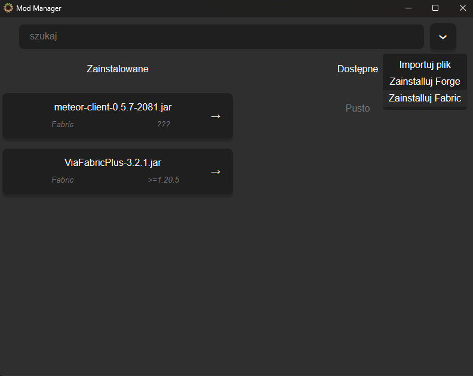

# Desktop Mod & Dependency Manager

A cross-platform desktop application built with Tauri, Rust, and VueJS. It automates the installation of Minecraft modifications, providing a seamless, lightweight UI for managing `.jar` files and mod loaders.



## ⚙️ Technical Highlights
* **Tauri Architecture:** Replaces heavy Electron-style webviews with the lightweight Tauri framework. The UI is served via the OS-native webview while the heavy lifting is done by a compiled Rust binary, drastically reducing memory footprint and bundle size.
* **Direct Archive Parsing:** Implements native Rust file-system logic to decompress and parse `.jar` archives on the fly. It automatically extracts internal metadata (e.g., `fabric.mod.json`) to resolve required mod-loader versions and dependencies without launching the game.
* **Modern Frontend:** Built with VueJS and TypeScript to provide a reactive, responsive, and intuitive dark-theme experience for end-users.

## 🛠️ Core Features & UX
* **Metadata Extraction:** Automatically displays the required loader (e.g., Fabric, Forge) and target game versions (e.g., `>=1.20.5`) upon importing a mod.
* **Intuitive State Management:** Seamlessly move mods between "Installed" and "Available" lists with a simple left-click, or permanently delete them with a right-click.
* **Automated Loader Installation:** One-click automated installation pipelines for Fabric and Forge mod loaders directly from the UI dropdown.
* **Live Search:** Clean separation of installed vs. available mods, complete with real-time search filtering.

## 📜 Project History (The Rust Rewrite)
This application was originally developed (v1.0.0) four years ago using **C# WinForms** ([view the archived legacy source here](https://github.com/markrz-0/modmanager)). As the scope of the project grew and my engineering capabilities evolved, the architecture was completely redesigned and rewritten from scratch into its current state (v2.0.0+) utilizing the modern **Rust + Tauri + VueJS** stack. This migration was undertaken to modernize the UI, ensure cross-platform compatibility, and drastically improve file I/O performance and memory safety.

## 🚀 Quick Start

Ensure you have the [Tauri CLI prerequisites](https://tauri.app/v1/guides/getting-started/prerequisites) (Rust, Node.js, and OS-specific build tools) installed before proceeding.

```bash
# Clone the repository
git clone https://github.com/markrz-0/minecraft-mod-manager-rs.git
cd minecraft-mod-manager-rs

# Install frontend dependencies
npm install

# Run the desktop application in development mode
npm run tauri dev

# To build the final executable for your OS:
npm run tauri build
```